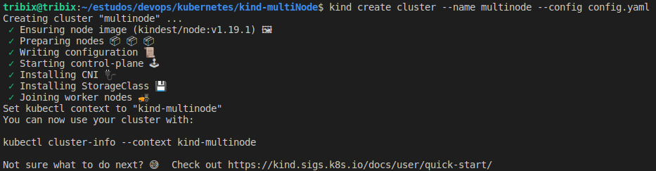
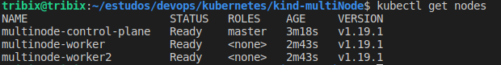

# Descrição do projeto
> Laboratório de estudo de Kubernetes utilizando o Kind.

### Pré-requisitos

- [Docker](https://docs.docker.com/engine/install/)
- [Kubectl](https://kubernetes.io/docs/tasks/tools/install-kubectl/)
- [Kind](https://kind.sigs.k8s.io/docs/user/quick-start/)

### 🚀 Execução

Com todos os serviços instalados (Docker, Kubectl e Kind), é necessário a criação dos clusteres, execute o comando abaixo
```console
$ kind create cluster --name multinode --config config.yaml
```

Finalizado a criaçãodo cluster, execute o seguinte comando:

```console
$ kubectl get nodes
```

A saida deve ser algo semalhante as imagens abaixo:




Para fazer o deployment da API, basta executar o comando:

```console
$ kubectl apply -f . -R
```

Para acessar coloque no seu navegador:


### 🛠 Tecnologias


### **:books: REFERÊNCIAS**

- [Docker](https://docs.docker.com/engine/install/)
- [Kubectl](https://kubernetes.io/docs/tasks/tools/install-kubectl/)
- [Kind](https://kind.sigs.k8s.io/docs/user/quick-start/)
- [Semana KubeDev](https://www.youtube.com/c/fabricioveronez/featured)